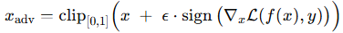
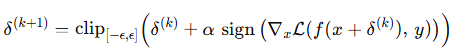
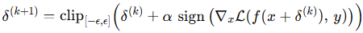
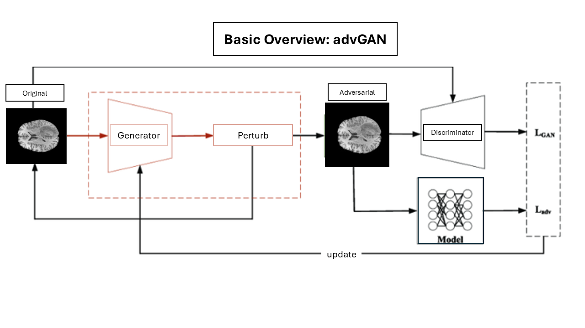
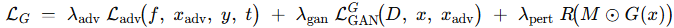
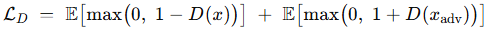
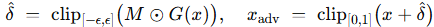

# Adversarial-Attacks-for-Medical-Imaging-Data

## TL;DR
This repo focuses on generating new adversarial examples for MRI, not just replaying the classics. We train a lightweight 2D CNN for tumour presence on BraTS 2021, then use an AdvGAN attacker to *generate* fresh, localized perturbations under realistic constraints (e.g., tumour or ring masks, shape-controlled patches). The aim: make it easy to explore adversarial behaviours beyond textbook gradients and actually see where the model breaks.

## Contents
- [Repo Layout](#repo-layout)
- [Introduction](#introduction)
- [BrATS Dataset](#brats-dataset)
- [Methods](#methods)
  - [Baseline model](#baseline-model)
  - [Attacks](#attacks)
    - [FGSM](#fgsm)
    - [BIM](#bim)
    - [PGD](#pgd)
    - [AdvGAN](#advgan)
  - [Spatial masks and constraints](#spatial-masks-and-constraints)
- [References](#references)

## Repo Layout

~~~text
Adversarial-Attacks-for-Medical-Imaging-Data/
├─ docs/                          
├─ scripts/                       
│  ├─ build_cache.py              # cache builder
│  ├─ preprocess.py               # splits/shards/stats
│  ├─ train_baseline.py           # train CNN
│  ├─ eval_attack.py              # attacks + metrics
│  ├─ train_advgan.py             # AdvGAN training
│  ├─ sweep_patch_masks.py        # patch control
│  └─ run_pgd.py                  # PGD demo
├─ src/
│  ├─ attacks/                    # attack impls
│  │  ├─ __init__.py
│  │  ├─ base.py                  # mask/clamp/eps
│  │  ├─ fgsm.py                  # FGSM
│  │  ├─ pgd.py                   # BIM/PGD
│  │  └─ advgan.py                # AdvGAN
│  └─ eval/                       # eval utils
│     ├─ __init__.py
│     ├─ metrics.py              
│     ├─ visualize.py             
│     └─ make_mri_figure_set.py   
├─ tests/                         # (.gitkeep)
├─ requirements.txt              
├─ README.md
└─ .gitignore
~~~

## Introduction

### Why adversarial robustness and adversarial training matter
Deep imaging models can flip their prediction with tiny, structured changes to the input. In medical imaging this is especially risky because models may rely on broad, low-level patterns that are easy to nudge without obvious visual artifacts. Classic defenses (including adversarial training, input denoising, and feature squeezing) help, but higher adversarial accuracy usually costs clean accuracy, so we need systematic ways to test robustness and explore diverse failure modes.

### What are adversarial attacks?
An adversarial attack introduces a small perturbation that causes the model to misclassify. They can be broken into two categories:
- White-box attacks: the attacker knows the model and uses gradients (e.g., FGSM, BIM/PGD). Our FGSM supports targeted or untargeted variants and optional masking; BIM/PGD iterates small steps under an L_inf budget.
- Black-box attacks: the attacker does not know the model and relies on queries or transfer from a surrogate; not the focus here, but the same evaluator can be extended to run transfer-based tests in future work.

### What are adversarial patches?
Adversarial patches are localized perturbations with explicit size, shape, and placement. In medical images, constraining where and how we perturb matters for realism. This repo supports segmentation-aware masks (tumour or ring) and patch sweeps that vary shape, area, anchor, and overlap with segmentation, then reports attack success by coverage bins.

### What is adversarial training?
Adversarial training mixes adversarial examples into training to improve robustness. It is effective but sensitive to budgets and losses, and it often trades clean accuracy for robustness. Generative approaches like AdvGAN can diversify attacks beyond gradient recipes, which is useful for stress-testing and for probing failure modes your training did not see.

### This repo at a glance
We train a lightweight 2D CNN for tumour presence on BraTS 2021 and then:
- Generate mask-aware adversarial examples with an AdvGAN generator.
- Benchmark against strong white-box baselines (FGSM, BIM/PGD) with the same budgets and masks. The evaluator logs clean accuracy, robust accuracy, ASR, norms, TV, SSIM, and can save clean-adv-diff grids.

### Threat model (what we assume)
We mainly test a worst-case white-box setting: the attacker sees model architecture and weights and optimizes to cause misclassification (untargeted by default, targeted optional). Perturbations are bounded in L_inf and can be restricted to segmentation-derived regions (tumour or ring) to keep changes localized and realistic.

### Scope and limits
We focus on BraTS 2021, 2D slices, and a compact CNN to keep iterations fast and reproducible. AdvGAN training uses multiple losses and can be finicky, so we monitor both success and similarity (SSIM). Extending to black-box transfer or 3D is future work that fits the same evaluation harness.

## BrATS Dataset

BraTS 2021 is a multi-institutional brain tumor MRI dataset with expert segmentations. Each subject is a 3D volume with four MRI modalities:
- T1, T1ce, T2, FLAIR
- A tumor mask with subregions (enhancing, core, whole tumor)

What we use in this repo
- Task: slice-level tumour presence classification (positive if the slice mask has any tumor, negative otherwise).
- Mask: we merge the provided labels into a single binary tumor mask for simplicity. This mask also drives our spatial constraints (tumor-only, ring-around-tumor) and patch anchors.
- Modalities: by default we train on a single chosen channel (e.g. T2), but the cache stores all four modalities so you can switch or stack channels.

  

<em>T1 (a), T2 (b), and binary tumour mask (c) from the same axial slice.</em>

### Download

- Kaggle: [BraTS 2021 Task 1](https://www.kaggle.com/datasets/dschettler8845/brats-2021-task1)

## Methods

### Baseline model
We use a small 2D CNN for slice-level tumour presence.
- Input is a single channel by default (T2), resized to a fixed H x W. 
- Loss is BCEWithLogits. 
- Optimizer is Adam. 
- Class weighting is available if positives are rare.
### Attacks
We run over how all attacks are implemented in this next section. Note all attacks can be untargeted or targeted and can use masks.

#### FGSM 
Fast Gradient Sign Method (FGSM) makes a one-step change in the direction that increases loss.

  

<em>FGSM core update. Targeted flips the sign; masking multiplies by M.</em>

Where:
- f is the classifier, y is the true label, t is the target label.
- L is the loss (cross entropy).
- clip keeps intensities in range (for us, [0,1]).
- epsilon is the L_inf budget (for example, 4/255, 8/255).

How it works
1) Run a forward pass and compute the loss L(f(x), y). For targeted, use L(f(x), t).
2) Backprop to get the input gradient g = dL/dx.
3) Take the sign of g. For targeted, flip the sign.
4) Scale by epsilon to get delta = epsilon * sign(g).
5) If a mask M is given, apply it: delta = M * delta.
6) Add and clip: x_adv = clip(x + delta, 0, 1).

#### BIM
Basic Iterative Method (BIM) applies many small FGSM steps and keeps the perturbation within the L_inf ball.

  

<em>Iterative FGSM step; repeat K times, then x_adv = clip(x + delta^K).</em>

Where:
- f is the classifier; y is the true label; t is the target label.
- L is the loss; clip keeps intensities in [0,1].
- epsilon is the L_inf budget; alpha is the step size; K is the number of steps.

How it works
1) Start at x and set delta = 0.
2) For K steps, take a small FGSM step of size alpha.
3) Clamp delta to [-epsilon, epsilon] each step.
4) If a mask M is given, apply it to each update.
5) Form x_adv = clip(x + delta, 0, 1).

#### PGD
Projected Gradient Descent (PGD) is BIM with a random start inside the L_inf ball.

  

<em>Same iterative update as BIM; PGD also uses a random start delta^0 ~ U(-eps, eps).</em>

Where:
- f is the classifier; y is the true label; t is the target label.
- L is the loss; clip keeps intensities in [0,1].
- epsilon is the L_inf budget; alpha is the step size; K is the number of steps.

How it works
1) Random start: sample delta0 ~ U(-eps, eps). Set x0 = clip(x + delta0, 0, 1).
2) For K steps, compute g = dL/dx at (x + delta).
3) Update delta: delta <- delta + alpha * sign(g) for untargeted; subtract for targeted.
4) If a mask M is given, apply it to the step; then clamp delta to [-eps, eps].
5) Form x_adv = clip(x + delta, 0, 1).

#### AdvGAN
Unlike FGSM/BIM/PGD, AdvGAN **trains** a generator G to produce a perturbation in one forward pass. At test time it is just:
delta = G(x) -> mask and clamp -> x_adv = clip(x + delta, 0, 1).

  

Objective + Losses

- L_adv (attack/fooling loss): pushes the classifier to misclassify x_adv.
  Untargeted: maximize the classifier loss on the true label (equivalently, minimize -CE(f(x_adv), y)).
  Targeted: minimize the classifier loss toward the target t (CE(f(x_adv), t)).

- L_GAN (realism loss): encourages x_adv to look like a real MRI slice.
  Use a discriminator D with a stable objective (hinge or LS-GAN). G tries to fool D; D learns to tell real x from x_adv.

- R (perturbation regulariser): keeps the change small and smooth.
  Common choices: L1 norm on M*G(x) and/or Total Variation (TV). This discourages noisy artifacts.

- Projection (not a loss): clamp the perturbation to [-eps, eps] and clip the final image to [0,1] so constraints are always met.

- Weights: lambda_adv, lambda_gan, lambda_pert control the trade-offs between fooling strength, realism, and perturbation size.

How it works
1) Training: compute delta = clamp(M*G(x), -eps, eps). Form x_adv = clip(x + delta, 0, 1).
2) Update G to both fool the classifier f (attack loss) and satisfy the GAN loss; add a size or TV penalty.
3) Update D to tell x (real) from x_adv (fake).
4) Inference: one forward pass, same mask and clamp.

Why it is different
- FGSM/BIM/PGD optimize the input per image. AdvGAN **learns** a reusable attacker G.
- After training, attacks are fast and can respect tumour/ring masks for realism.

Loss balance tips
- Start: lambda_adv = 1.0, lambda_gan = 0.25 to 1.0, lambda_pert = 5 to 20.
- Use 1:1 or 2:1 D:G update ratio. A short D warmup can help.
- Hinge or LS-GAN losses are stable. Spectral norm on D is helpful; a light gradient penalty is optional.
- If artifacts appear: increase lambda_pert or lower eps. If ASR is low: increase lambda_adv or train longer. If D collapses: raise lambda_gan or increase D steps.

### Spatial masks and constraints

We restrict perturbations to anatomically relevant regions and small patches so edits stay local and realistic. The same mask logic works for FGSM, BIM, PGD, and AdvGAN.

Mask types
- seg: tumour-only pixels can change.
- ring: dilate seg by width w, subtract seg (tests near-tumour sensitivity).
- patch: small shapes (e.g., rect) with rel_w/rel_h and an anchor.

Controls
- combine: intersect or union with seg.
- edges: hard 0/1 mask or lightly blurred (soft).
- projection: clamp delta to [-eps, eps], clip x_adv to [0,1].

What we track
- coverage: fraction of tumour or image covered by M.
- ASR vs coverage: shows how much area is needed to fool the model.

## References
- FGSM: Goodfellow, Shlens, Szegedy. Explaining and Harnessing Adversarial Examples. https://arxiv.org/abs/1412.6572
- BIM (I-FGSM): Kurakin, Goodfellow, Bengio. Adversarial Examples in the Physical World. https://arxiv.org/abs/1607.02533
- PGD: Madry, Makelov, Schmidt, Tsipras, Vladu. Towards Deep Learning Models Resistant to Adversarial Attacks. https://arxiv.org/abs/1706.06083
- AdvGAN: Xiao, Li, Zhu, He. Generating Adversarial Examples with Adversarial Networks. https://arxiv.org/abs/1801.02610

